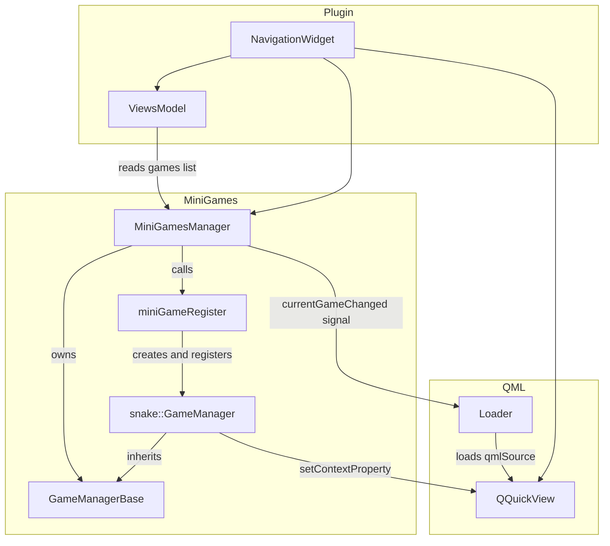
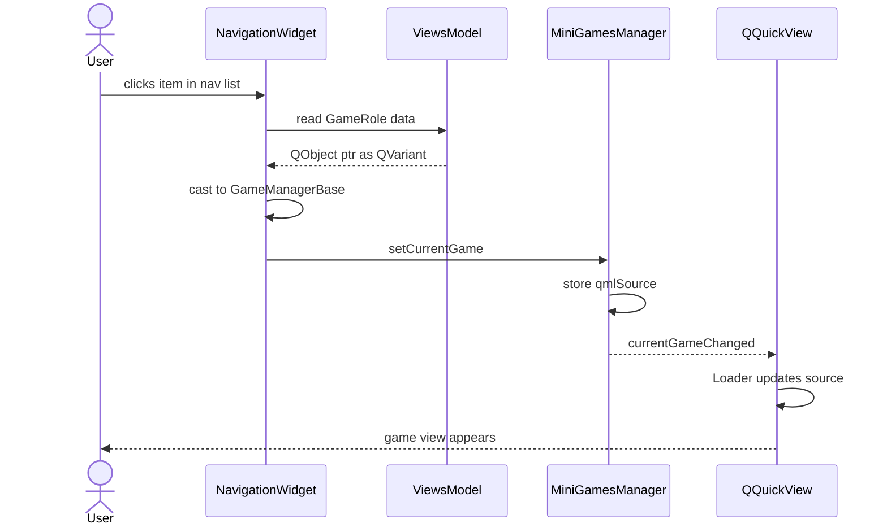

# MiniGames — developer reference

This document describes the mini-games subsystem and explains how to add a new game.

---

## Architecture



---

## Key responsibilities

| Class | Responsibility |
|-------|---------------|
| `GameManagerBase` | Timer lifecycle (`startGame` / `stopGame`), `tick()` hook, `gameRunning` Q_PROPERTY |
| `GameManager` (concrete) | Game logic in `tick()`, self-describes via `gameDescription()`, sets up its own QML context property |
| `MiniGamesManager` | Owns the game list, routes `setCurrentGame` → `currentGameChanged` signal read by QML |
| `miniGameRegister.hpp` | Single place where concrete games are instantiated and registered |
| `ViewsModel` | Reads `manager->games()` at construction; populates the nav list automatically |
| `NavigationWidget` | Wires everything: creates manager → calls `setupContext` → creates `ViewsModel` → handles clicks |

---

## Game selection flow



---

## How to add a new mini-game

Adding a game touches **two files only**: a new `GameManager` class and one line in `miniGameRegister.hpp`. Everything else (nav list, icons, QML routing) should be automatic.

### Step-by-step

#### 1. Create the directory structure

```
src/MiniGames/Games/YourGame/
├── CMakeLists.txt
├── GameManager/
│   ├── gameManager.h
│   └── gameManager.cpp
├── qml/
│   └── QMYourGame.qml
└── YourGame.qrc
```

#### 2. Implement `GameManagerBase`

```cpp
// gameManager.h
#pragma once
#include "Base/gameManagerBase.h"
#include "minigamesDefines.h"
class QQmlContext;

namespace yourgame {

class GameManager : public minigame::base::GameManagerBase {
    Q_OBJECT
public:
    explicit GameManager(QObject* parent = nullptr);

    minigame::defines::MiniGameDescription gameDescription() const;
    void setupGameContext(QQmlContext* ctx);

protected:
    void tick() override;
};

} // namespace yourgame
```

```cpp
// gameManager.cpp
static void initResources() { Q_INIT_RESOURCE(YourGame); }

namespace yourgame {

GameManager::GameManager(QObject* parent)
    : minigame::base::GameManagerBase(TICK_INTERVAL_MS, parent)
{
    initResources();
}

minigame::defines::MiniGameDescription GameManager::gameDescription() const {
    static minigame::defines::MiniGameDescription desc = {
        .qmlSource = QUrl("qrc:/yourgame/QMYourGame.qml"),
        .name      = tr("Your Game"),
        .iconName  = "yourgame.svg"
    };
    return desc;
}

void GameManager::setupGameContext(QQmlContext* ctx) {
    ctx->setContextProperty("yourGameManager", this);
}

void GameManager::tick() {
    // game logic here — called on each timer interval
}

} // namespace yourgame
```

> **Important:** `Q_INIT_RESOURCE` must be called from a free function at global scope, not inside a namespace. The `static void initResources()` wrapper before the `namespace` block handles this.

#### 3. Add `CMakeLists.txt` for the new game

```cmake
set(SOURCES GameManager/gameManager.cpp)
set(HEADERS GameManager/gameManager.h)
set(RESOURCE YourGame.qrc)

add_library(yourgame STATIC ${SOURCES} ${HEADERS} ${RESOURCE})
target_link_libraries(yourgame PUBLIC minigames-base Qt::Quick Qt::Qml)
target_include_directories(yourgame PUBLIC ${CMAKE_CURRENT_SOURCE_DIR})
```

Then in `src/MiniGames/CMakeLists.txt` add:

```cmake
add_subdirectory(Games/YourGame)
target_link_libraries(minigames PUBLIC ... yourgame)
```

#### 4. Register the game

In `src/MiniGames/miniGameRegister.hpp`:

```cpp
#include "Games/Snake/GameManager/gameManager.h"
#include "Games/YourGame/GameManager/gameManager.h"   // <- add this

static void registerMiniGames(MiniGamesManager* manager) {
    manager->registerGame(new snake::GameManager(manager));
    manager->registerGame(new yourgame::GameManager(manager));  // <- add this
}
```

#### 5. Add the icon

Place `yourgame.svg` in both:
- `src/icons/dark-theme/yourgame.svg`
- `src/icons/light-theme/yourgame.svg`

And reference them in `src/Resource.qrc`.

---

`ViewsModel` reads `manager->games()` at startup and adds every registered game to the nav list automatically. No changes to `NavigationWidget`, `ViewsModel`, or `MiniGamesManager` are needed.
